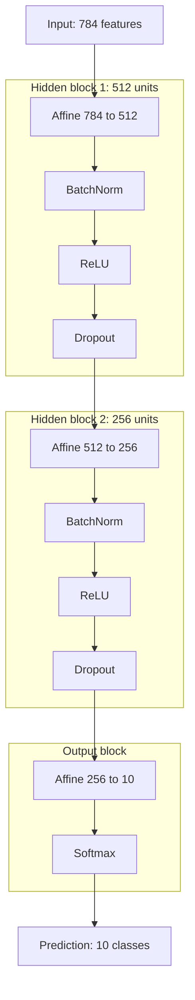
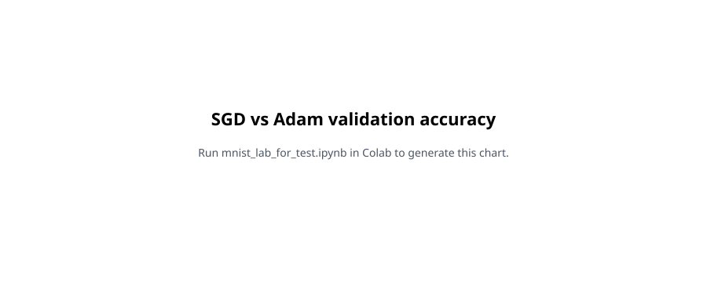
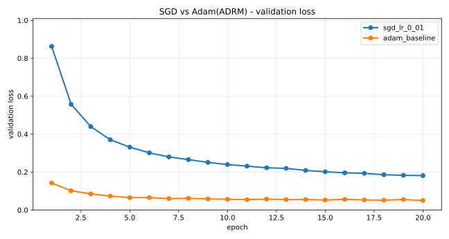
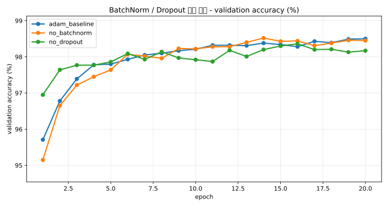
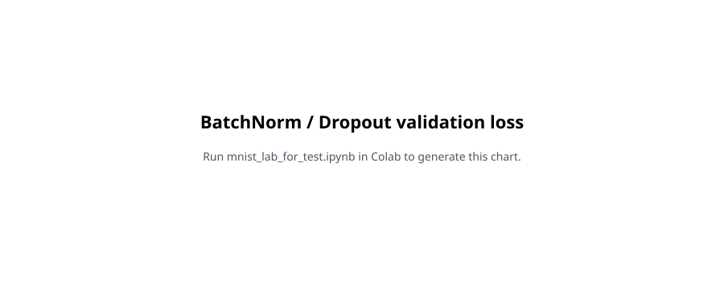
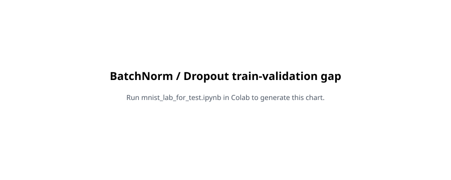
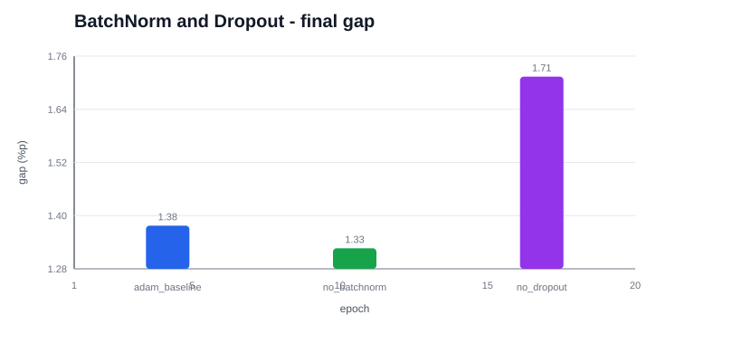
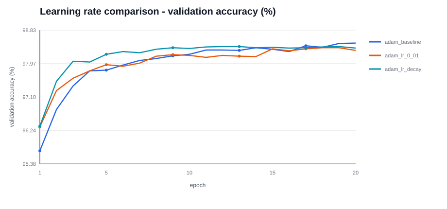
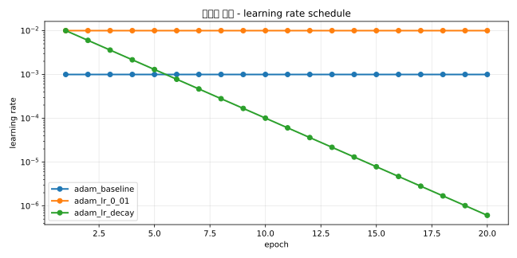

# MNIST 전략 비교 실험 보고서

## 0. 반·팀원

| 항목 | 내용 |
| --- | --- |
| **반** | (기입) |
| **팀원** | (기입) |

---

## 1. 프로젝트 요약

MNIST 10-class 분류를 **NumPy만으로 구현한 신경망**으로 수행하고, 같은 모델 구조에서 학습 전략을 바꿨을 때 검증 성능이 어떻게 달라지는지 비교했다. 모든 실험에서 **ReLU 활성화 함수와 He 초기화는 고정**했고, optimizer, BatchNorm, Dropout, learning rate만 바꿨다.

| 핵심 항목 | 결과 |
| --- | --- |
| 목표 | MNIST 검증/테스트 정확도 97% 이상 |
| 최고 validation accuracy | **98.52%** (`no_batchnorm`, best epoch 14) |
| 기준 모델 final validation accuracy | **98.50%** (`adam_baseline`) |
| 최종 제출 후보 | `adam_lr_decay` |
| 총 실험 수 | 6회 |
| 공통 모델 크기 | BatchNorm on 기준 537,354 params |

최고 정확도만 보면 `no_batchnorm`이 98.52%로 가장 높았다. 하지만 `adam_baseline`의 98.50%와 차이가 0.02%p에 불과하므로, 이 차이만으로 BatchNorm 제거가 더 좋다고 판단하기는 어렵다. 이번 실험은 단일 seed 결과이기 때문에 0.1~0.2%p 수준의 차이는 반복 실행 시 순위가 바뀔 수 있는 범위로 보고, validation loss와 train-validation gap을 함께 비교했다.

---

## 2. 모델 구조

기본 모델은 28x28 이미지를 784차원 벡터로 펼친 뒤, 두 개의 은닉층과 하나의 출력층을 통과하는 완전연결 신경망이다. 비교 전략에 따라 BatchNorm과 Dropout을 끄는 경우가 있지만, 기본 구조는 다음과 같다.

| 구분 | 내용 |
| --- | --- |
| **입력** | 784차원 벡터 (28x28 픽셀, 0~1 정규화) |
| **은닉층 1** | Affine(784 to 512) -> BatchNorm -> ReLU -> Dropout |
| **은닉층 2** | Affine(512 to 256) -> BatchNorm -> ReLU -> Dropout |
| **출력층** | Affine(256 to 10) -> Softmax |
| **손실 함수** | Cross Entropy Loss |
| **고정 조건** | ReLU, He 초기화 |

파라미터 수는 Affine 계층이 535,818개이고, BatchNorm을 켜면 gamma/beta 1,536개가 추가되어 총 537,354개가 된다. Dropout, ReLU, Softmax는 학습 파라미터를 갖지 않는다.

---

## 3. 학습 설정 및 기록 방식

공통 학습 설정은 다음과 같다.

| 항목 | 값 |
| --- | --- |
| epochs | 20 |
| batch_size | 128 |
| train metric 측정 | 고정 train subset 10,000개 |
| validation/test metric 측정 | 전체 `x_test`, `y_test` |
| seed | 42 |
| Dropout 비율 | 0.5 |
| BatchNorm momentum | 0.9 |
| 초기화 | He |

비교한 실험은 총 6회다. `adam_baseline`은 세 비교 그룹의 공통 기준으로 사용했다.

| strategy | 비교 그룹 | optimizer | lr | lr schedule | BatchNorm | Dropout | params |
| --- | --- | --- | ---: | --- | --- | --- | ---: |
| `adam_baseline` | 공통 기준 | Adam | 0.001 | 없음 | on | on | 537,354 |
| `sgd_lr_0_01` | SGD vs Adam | SGD | 0.01 | 없음 | on | on | 537,354 |
| `no_batchnorm` | BatchNorm 유무 | Adam | 0.001 | 없음 | off | on | 535,818 |
| `no_dropout` | Dropout 유무 | Adam | 0.001 | 없음 | on | off | 537,354 |
| `adam_lr_0_01` | 학습률 비교 | Adam | 0.01 | 없음 | on | on | 537,354 |
| `adam_lr_decay` | 학습률 비교 | Adam | 0.01 시작 | `0.01 * 0.6^epoch` | on | on | 537,354 |

실행은 Google Colab에서 `mnist_lab_for_test.ipynb`의 비교 실험 셀로 수행했다. 로컬에서는 학습을 실행하지 않았고, Colab에서 생성된 결과 파일을 저장소로 옮겼다.

| 파일 | 내용 |
| --- | --- |
| `experiment_logs/grouped_strategy_run_20260527-115521.txt` | 사람이 읽을 수 있는 전체 epoch 로그 |
| `experiment_logs/grouped_strategy_run_20260527-115521.csv` | strategy, epoch, lr, loss, accuracy, params 등 구조화 로그 |
| `experiment_logs/grouped_strategy_summary_20260527-115521.md` | 전체 비교 수치표 |
| `report_assets/*.svg` | 리포트에 붙일 그룹별 비교 그래프 |

---

## 4. 전체 결과

전체 비교는 그래프 없이 수치표로 정리한다.

| strategy | optimizer | final val acc | best val acc | best epoch | train acc | val loss | final lr | params | BN | Dropout |
| --- | --- | ---: | ---: | ---: | ---: | ---: | ---: | ---: | --- | --- |
| `adam_baseline` | Adam | 98.50% | 98.50% | 20 | 99.88% | 0.0499 | 0.001000 | 537,354 | True | True |
| `sgd_lr_0_01` | SGD | 94.42% | 94.53% | 18 | 94.62% | 0.1812 | 0.010000 | 537,354 | True | True |
| `no_batchnorm` | Adam | 98.45% | 98.52% | 14 | 99.78% | 0.0572 | 0.001000 | 535,818 | False | True |
| `no_dropout` | Adam | 98.17% | 98.36% | 16 | 99.88% | 0.0773 | 0.001000 | 537,354 | True | False |
| `adam_lr_0_01` | Adam | 98.31% | 98.38% | 18 | 99.71% | 0.0578 | 0.010000 | 537,354 | True | True |
| `adam_lr_decay` | Adam | 98.37% | 98.41% | 12 | 99.54% | 0.0515 | 0.000001 | 537,354 | True | True |

SGD를 제외한 Adam 기반 실험은 모두 98% 이상의 validation accuracy를 달성했다. 가장 큰 차이는 optimizer 비교에서 나타났고, Adam이 SGD보다 20 epoch 안에서 훨씬 빠르게 수렴했다. 반면 Adam 기반 실험들 사이의 accuracy 차이는 대부분 작았기 때문에, 최종 판단은 validation loss와 train-validation gap까지 함께 고려했다.

---

## 5. 비교 실험

### 5.1 SGD vs Adam 비교

| strategy | optimizer | lr | BatchNorm | Dropout |
| --- | --- | ---: | --- | --- |
| `sgd_lr_0_01` | SGD | 0.01 | on | on |
| `adam_baseline` | Adam | 0.001 | on | on |

결과 요약:

- `adam_baseline`: final validation accuracy 98.50%, final validation loss 0.0499
- `sgd_lr_0_01`: final validation accuracy 94.42%, final validation loss 0.1812
- Adam은 20 epoch 안에서 SGD보다 validation accuracy가 4.08%p 높고, validation loss도 크게 낮았다.
- SGD는 train-validation gap은 작았지만, 전체 수렴 수준이 낮았다.

소결: 같은 BatchNorm, Dropout, He 초기화 조건에서는 Adam이 SGD보다 빠르게 수렴했다. SGD lr=0.01은 학습 자체는 진행됐지만, 20 epoch 기준으로 목표 정확도 97%에 도달하지 못했다.

---

### 5.2 BatchNorm, Dropout 유무 비교

| strategy | BatchNorm | Dropout | 목적 |
| --- | --- | --- | --- |
| `adam_baseline` | on | on | 기준 |
| `no_batchnorm` | off | on | BatchNorm 효과 확인 |
| `no_dropout` | on | off | Dropout 일반화 효과 확인 |

결과 요약:

- `adam_baseline`: final validation accuracy 98.50%, final validation loss 0.0499
- `no_batchnorm`: final validation accuracy 98.45%, best validation accuracy 98.52%, final validation loss 0.0572
- `no_dropout`: final validation accuracy 98.17%, final validation loss 0.0773, final train-validation gap 1.71%p
- BatchNorm을 제거해도 accuracy 손실은 작았지만, validation loss는 baseline보다 높았다.
- Dropout을 제거하면 train loss가 매우 낮아지지만, validation loss가 가장 높아졌다.

Dropout 비교는 gap 자체보다 **gap이 커지는 속도와 validation/test 성능의 흐름**을 함께 봐야 한다.

- **Dropout OFF**: gap이 빠르게 커지고, validation/test 성능이 일찍 정체된다.
- **Dropout ON**: gap이 더 천천히 커지고, validation/test 성능이 더 오래 개선된다.
- 따라서 Dropout을 켰는데도 gap이 커졌다는 사실만으로 실패라고 볼 수 없다. gap이 커지는 속도와 validation/test accuracy 최고점이 좋아졌는지를 같이 봐야 한다.

`adam_baseline`과 `no_batchnorm`도 학습이 진행되면서 train-validation gap은 늘어난다. 하지만 validation accuracy가 계속 개선되므로 gap 증가만으로 과적합이라고 보기는 어렵다. 반면 `no_dropout`은 1 epoch부터 gap이 1.20%p로 컸고, 3 epoch에는 1.73%p까지 벌어졌다. 이후 train accuracy는 거의 100%에 가까워졌지만 validation loss는 최종 0.0773으로 가장 높았다. 따라서 Dropout을 제거하면 학습 데이터에는 매우 빠르게 맞지만, 검증 데이터 기준의 일반화는 상대적으로 나빠진다.

---

### 5.3 Learning rate 비교

| strategy | optimizer | lr 설정 | 목적 |
| --- | --- | --- | --- |
| `adam_baseline` | Adam | 0.001 고정 | 기준 학습률 |
| `adam_lr_0_01` | Adam | 0.01 고정 | 큰 학습률 |
| `adam_lr_decay` | Adam | `0.01 * 0.6^epoch` | 큰 lr로 시작 후 감소 |

결과 요약:

- `adam_baseline` lr=0.001: final validation accuracy 98.50%, final validation loss 0.0499
- `adam_lr_0_01` lr=0.01: final validation accuracy 98.31%, final validation loss 0.0578
- `adam_lr_decay`: final validation accuracy 98.37%, best validation accuracy 98.41%, final validation loss 0.0515, final train-validation gap 1.17%p
- lr=0.01 고정은 baseline보다 빠르게 시작할 수 있지만 최종 accuracy/loss는 baseline보다 낮았다.
- decay는 lr=0.01 고정보다 validation loss가 낮고 안정적이었다.

소결: final validation accuracy는 Adam lr=0.001 baseline이 가장 높다. 그러나 baseline과 decay의 차이는 0.13%p로 작고, decay의 train-validation gap이 더 작다. 정확도만 기준으로 두면 baseline이 앞서지만, 일반화 gap까지 포함하면 decay 쪽이 더 안정적인 결과다.

---

## 6. 종합 결론

이번 실험의 결론은 다음과 같다.

| 관점 | 결론 |
| --- | --- |
| Optimizer | Adam이 SGD보다 20 epoch 안에서 훨씬 빠르게 수렴했다. |
| BatchNorm | 제거해도 accuracy 손실은 작았지만 validation loss는 baseline보다 높았다. |
| Dropout | OFF에서는 gap이 빠르게 커지고 validation/test 성능이 일찍 정체됐다. ON에서는 gap이 더 천천히 커지고 성능 개선이 더 오래 이어졌다. |
| Learning rate | accuracy 단일 기준은 Adam lr=0.001 baseline이 가장 높았고, 일반화 안정성 기준은 decay가 더 나았다. |
| 최종 후보 | `Adam(learning rate decay) + BatchNorm on + Dropout on + He 초기화` |

최종 accuracy만 기준으로 삼으면 `Adam(lr=0.001) + BatchNorm on + Dropout on + He 초기화`가 가장 높은 결과를 냈다. 그러나 반복 실행 편차와 train-validation gap까지 고려하면 `Adam(learning rate decay) + BatchNorm on + Dropout on + He 초기화`가 일반화 측면에서 더 안정적이다. 따라서 최종 제출 후보는 decay 전략으로 두고, accuracy 단일 지표에서는 baseline이 0.13%p 앞선 것으로 기록한다.
