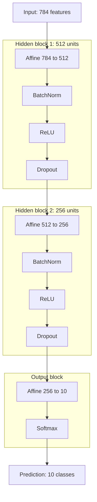

# MNIST 전략 비교 실험 보고서

## 0. 반·팀원

| 항목 | 내용 |
| --- | --- |
| **반** | (기입) |
| **팀원** | (기입) |

---

## 1. 실험 목적

MNIST 10-class 분류를 **NumPy만으로 구현한 신경망**으로 수행하고, 다음 세 축이 학습 과정과 테스트 성능에 주는 영향을 비교한다.

1. SGD vs Adam(ADRM)
2. BatchNorm, Dropout 유무
3. learning rate 0.01, 0.001, decay loss 비교

모든 실험에서 **ReLU 활성화 함수와 He 초기화는 고정**한다.

---

## 2. 모델 구조

| 구분 | 내용 |
| --- | --- |
| **입력** | 784차원 벡터 (28x28 픽셀, 0~1 정규화) |
| **기본 은닉층** | Hidden block 1(512) -> Hidden block 2(256) |
| **출력층** | Affine(10) -> Softmax |
| **손실 함수** | Cross Entropy Loss |
| **고정 조건** | ReLU, He 초기화 |

기본 구조는 `784 -> 512 -> 256 -> 10`이다. 비교 전략에 따라 optimizer, learning rate, BatchNorm 사용 여부, Dropout 사용 여부만 바꾼다.



---

## 3. 학습 설정 및 예상 테스트 횟수

공통 설정은 다음과 같다.

| 항목 | 값 |
| --- | --- |
| epochs | 20 |
| batch_size | 128 |
| train metric 측정 | 고정 train subset 10,000개 |
| validation/test metric 측정 | 전체 `x_test`, `y_test` |
| seed | 42 |
| Dropout 비율 | 0.5 |
| BatchNorm momentum | 0.9 |
| 초기화 | He |

총 예상 테스트 횟수는 **6회**이다. `adam_baseline`을 세 비교 그룹에서 공통 기준으로 재사용하여 중복 실행을 줄인다.

| strategy | 비교 그룹 | optimizer | lr | lr schedule | BatchNorm | Dropout | 예상 params |
| --- | --- | --- | ---: | --- | --- | --- | ---: |
| `adam_baseline` | 공통 기준 | Adam | 0.001 | 없음 | on | on | 537,354 |
| `sgd_lr_0_01` | SGD vs Adam | SGD | 0.01 | 없음 | on | on | 537,354 |
| `no_batchnorm` | BatchNorm 유무 | Adam | 0.001 | 없음 | off | on | 535,818 |
| `no_dropout` | Dropout 유무 | Adam | 0.001 | 없음 | on | off | 537,354 |
| `adam_lr_0_01` | 학습률 비교 | Adam | 0.01 | 없음 | on | on | 537,354 |
| `adam_lr_decay` | 학습률 비교 | Adam | 0.01 시작 | `0.01 * 0.6^epoch` | on | on | 537,354 |

파라미터 수 계산:

- Affine 계층: `784*512+512 + 512*256+256 + 256*10+10 = 535,818`
- BatchNorm 학습 파라미터: `gamma1/beta1 512*2 + gamma2/beta2 256*2 = 1,536`
- BatchNorm on 모델: `535,818 + 1,536 = 537,354`
- Dropout, ReLU, Softmax는 학습 파라미터가 없다.
- Adam의 `m`, `v`는 optimizer state이므로 모델 파라미터 수에 포함하지 않는다.

---

## 4. 실행 및 기록 방식

실행은 Google Colab에서 `mnist_lab_for_test.ipynb`의 비교 실험 셀로 수행했다. 로컬에서는 학습을 실행하지 않았고, Colab에서 생성된 결과 파일을 저장소의 `experiment_logs/`, `report_assets/`로 옮겼다.

노트북은 실행 결과를 다음 파일로 저장한다.

| 파일 | 내용 |
| --- | --- |
| `experiment_logs/grouped_strategy_run_20260527-115521.txt` | 사람이 읽을 수 있는 전체 epoch 로그 |
| `experiment_logs/grouped_strategy_run_20260527-115521.csv` | strategy, epoch, lr, loss, accuracy, params 등 구조화 로그 |
| `experiment_logs/grouped_strategy_summary_20260527-115521.md` | 전체 비교 수치표 |
| `report_assets/*.svg` | 리포트에 붙일 그룹별 비교 그래프 |

CSV에는 다음 항목이 기록된다.

```text
strategy,label,optimizer,epoch,lr,train_loss,train_acc,val_loss,val_acc,params,
use_batchnorm,use_dropout,dropout_ratio,init_method
```

---

## 5. 전체 비교

전체 비교는 그래프 없이 수치표로만 정리한다.

| strategy | optimizer | final val acc | best val acc | best epoch | train acc | val loss | final lr | params | BN | Dropout |
| --- | --- | ---: | ---: | ---: | ---: | ---: | ---: | ---: | --- | --- |
| `adam_baseline` | Adam | 98.50% | 98.50% | 20 | 99.88% | 0.0499 | 0.001000 | 537,354 | True | True |
| `sgd_lr_0_01` | SGD | 94.42% | 94.53% | 18 | 94.62% | 0.1812 | 0.010000 | 537,354 | True | True |
| `no_batchnorm` | Adam | 98.45% | 98.52% | 14 | 99.78% | 0.0572 | 0.001000 | 535,818 | False | True |
| `no_dropout` | Adam | 98.17% | 98.36% | 16 | 99.88% | 0.0773 | 0.001000 | 537,354 | True | False |
| `adam_lr_0_01` | Adam | 98.31% | 98.38% | 18 | 99.71% | 0.0578 | 0.010000 | 537,354 | True | True |
| `adam_lr_decay` | Adam | 98.37% | 98.41% | 12 | 99.54% | 0.0515 | 0.000001 | 537,354 | True | True |

전체 결과에서 SGD를 제외한 Adam 기반 실험은 모두 98% 이상의 validation accuracy를 달성했다. SGD는 같은 20 epoch 안에서는 94.42%에 머물러, 이번 설정에서는 Adam보다 수렴 속도가 확실히 느렸다.

본 실험은 seed 42로 한 번 실행한 결과다. MNIST 학습은 초기 가중치, 미니배치 순서, Dropout mask의 영향을 받으므로 0.1~0.2%p 수준의 차이는 반복 실행 시 순위가 바뀔 수 있는 범위로 본다. 따라서 `adam_baseline`, `no_batchnorm`, `adam_lr_decay`, `adam_lr_0_01`처럼 정확도 차이가 작은 실험은 validation loss와 train-validation gap을 함께 비교한다.

---

## 6. SGD vs Adam(ADRM) 비교

비교 대상:

| strategy | optimizer | lr | BatchNorm | Dropout |
| --- | --- | ---: | --- | --- |
| `sgd_lr_0_01` | SGD | 0.01 | on | on |
| `adam_baseline` | Adam | 0.001 | on | on |

결과 요약:

- `adam_baseline`: final validation accuracy 98.50%, final validation loss 0.0499
- `sgd_lr_0_01`: final validation accuracy 94.42%, final validation loss 0.1812
- Adam은 20 epoch 안에서 SGD보다 validation accuracy가 4.08%p 높고, validation loss도 크게 낮았다. 이 차이는 단일 실행 편차로 설명하기 어려운 수준이다.
- SGD는 train accuracy 94.62%, validation accuracy 94.42%로 train-validation gap은 작지만, 전체 수렴 수준이 낮다.


소결: 같은 BatchNorm, Dropout, He 초기화 조건에서는 Adam이 SGD보다 빠르게 수렴했다. SGD lr=0.01은 학습 자체는 진행됐지만, 20 epoch 기준으로 목표 정확도 97%에 도달하지 못했다.

---

## 7. BatchNorm, Dropout 유무 비교

비교 대상:

| strategy | BatchNorm | Dropout | 목적 |
| --- | --- | --- | --- |
| `adam_baseline` | on | on | 기준 |
| `no_batchnorm` | off | on | BatchNorm 효과 확인 |
| `no_dropout` | on | off | Dropout 일반화 효과 확인 |

결과 요약:

- `adam_baseline`: final validation accuracy 98.50%, final validation loss 0.0499
- `no_batchnorm`: final validation accuracy 98.45%, best validation accuracy 98.52%, final validation loss 0.0572
- `no_dropout`: final validation accuracy 98.17%, final validation loss 0.0773, final train-validation gap 1.71%p
- BatchNorm을 제거해도 최고 정확도는 98.52%까지 도달했지만, 최종 loss는 baseline보다 높았다. 정확도 차이가 작기 때문에 BatchNorm의 효과는 final accuracy보다 validation loss 기준에서 더 잘 드러난다.
- Dropout을 제거하면 train loss가 매우 낮아지지만 validation loss가 가장 높아져 과적합 경향이 뚜렷했다.


소결: BatchNorm 유무에 따른 정확도 차이는 작았다. 반면 Dropout 제거는 train accuracy를 빠르게 끌어올렸지만 validation loss가 가장 높게 남았다.

위 그래프는 gap을 validation accuracy 흐름과 함께 보여준다. `adam_baseline`과 `no_batchnorm`도 학습이 진행되면서 train-validation gap은 늘어나지만, validation accuracy가 계속 개선되므로 gap 증가만으로 과적합이라고 보기는 어렵다. 반면 `no_dropout`은 1 epoch부터 gap이 1.20%p로 컸고, 3 epoch에는 1.73%p까지 벌어졌다. 이후 train accuracy는 거의 100%에 가까워졌지만 validation loss는 최종 0.0773으로 가장 높았다. 따라서 Dropout을 제거하면 학습 데이터에는 매우 빠르게 맞지만, 검증 데이터 기준의 일반화는 상대적으로 나빠진다.

---

## 8. 학습률 비교

비교 대상:

| strategy | optimizer | lr 설정 | 목적 |
| --- | --- | --- | --- |
| `adam_baseline` | Adam | 0.001 고정 | 기준 학습률 |
| `adam_lr_0_01` | Adam | 0.01 고정 | 큰 학습률 |
| `adam_lr_decay` | Adam | `0.01 * 0.6^epoch` | 큰 lr로 시작 후 감소 |

결과 요약:

- `adam_baseline` lr=0.001: final validation accuracy 98.50%, final validation loss 0.0499
- `adam_lr_0_01` lr=0.01: final validation accuracy 98.31%, final validation loss 0.0578
- `adam_lr_decay`: final validation accuracy 98.37%, best validation accuracy 98.41%, final validation loss 0.0515, final train-validation gap 1.17%p
- lr=0.01 고정은 baseline보다 빠르게 시작할 수 있지만 최종 accuracy/loss는 baseline보다 낮았다.
- decay는 lr=0.01 고정보다 validation loss가 낮고 안정적이었다. lr=0.001 baseline보다 최종 정확도는 0.13%p 낮지만, 이 차이는 단일 실행 편차 범위에 가깝고 train-validation gap은 baseline 1.38%p보다 낮은 1.17%p였다.


소결: final validation accuracy는 Adam lr=0.001 baseline이 가장 높다. 그러나 baseline과 decay의 차이는 0.13%p로 작고, decay의 train-validation gap이 더 작다. 정확도만 기준으로 두면 baseline이 앞서지만, 일반화 gap까지 포함하면 decay 쪽이 더 안정적인 결과다.

---

## 9. 결론

실험 결과를 기준별로 정리하면 다음과 같다.

- Optimizer 비교에서는 Adam이 SGD보다 빠르게 수렴했다. SGD lr=0.01은 20 epoch 기준 validation accuracy 94.42%로 97%에 도달하지 못했다.
- BatchNorm을 제거해도 accuracy 손실은 크지 않았지만, validation loss는 baseline보다 높았다. 이번 결과에서는 BatchNorm의 차이가 accuracy보다 loss에서 더 뚜렷했다.
- Dropout 제거는 train accuracy를 빠르게 높였지만 validation loss가 가장 높았다. train-validation gap도 초반부터 크게 벌어져 과적합 경향이 가장 분명했다.
- Learning rate 비교에서는 `adam_baseline`이 final validation accuracy 98.50%로 가장 높았다. 다만 `adam_lr_decay`도 98.37%로 차이가 0.13%p에 그쳤고, train-validation gap은 1.17%p로 baseline의 1.38%p보다 작았다.
- 전체 최고 validation accuracy는 `no_batchnorm`의 98.52%였지만, `adam_baseline`의 98.50%와 0.02%p 차이에 불과하다. 이 차이만으로 BatchNorm 제거가 우세하다고 보기는 어렵다.

최종 accuracy만 기준으로 삼으면 `Adam(lr=0.001) + BatchNorm on + Dropout on + He 초기화`가 가장 높은 결과를 냈다. 그러나 반복 실행 편차와 train-validation gap까지 고려하면 `Adam(learning rate decay) + BatchNorm on + Dropout on + He 초기화`가 일반화 측면에서 더 안정적이다. 최종 제출 후보는 decay 전략으로 두고, accuracy 단일 지표에서는 baseline이 0.13%p 앞선 것으로 기록한다.
