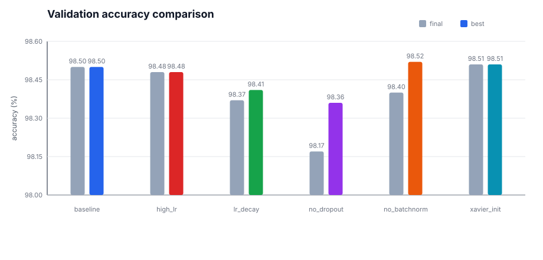
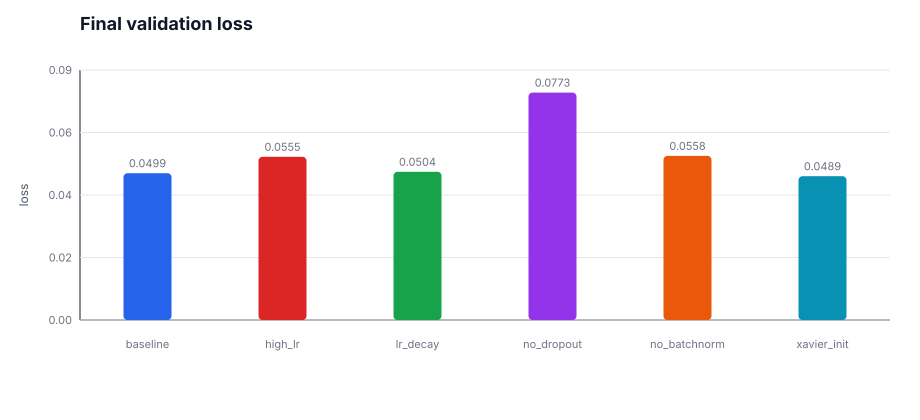
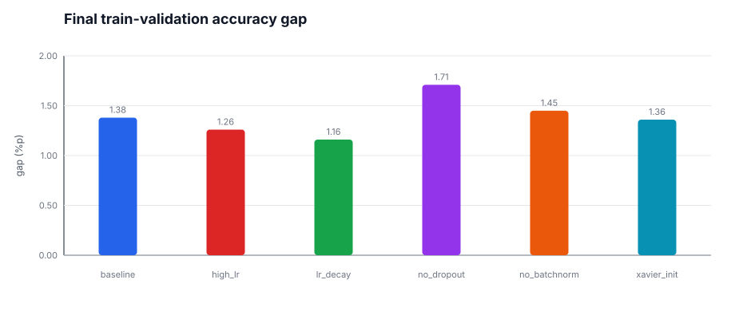
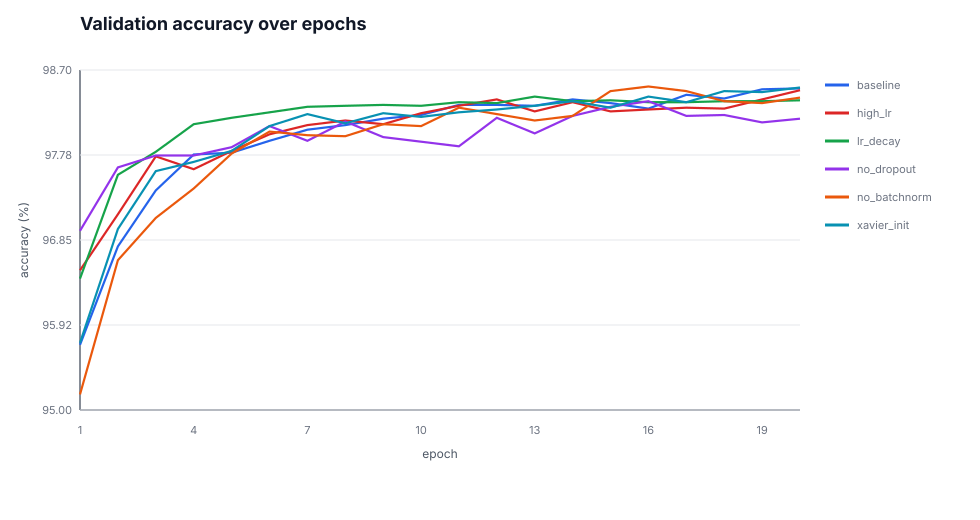
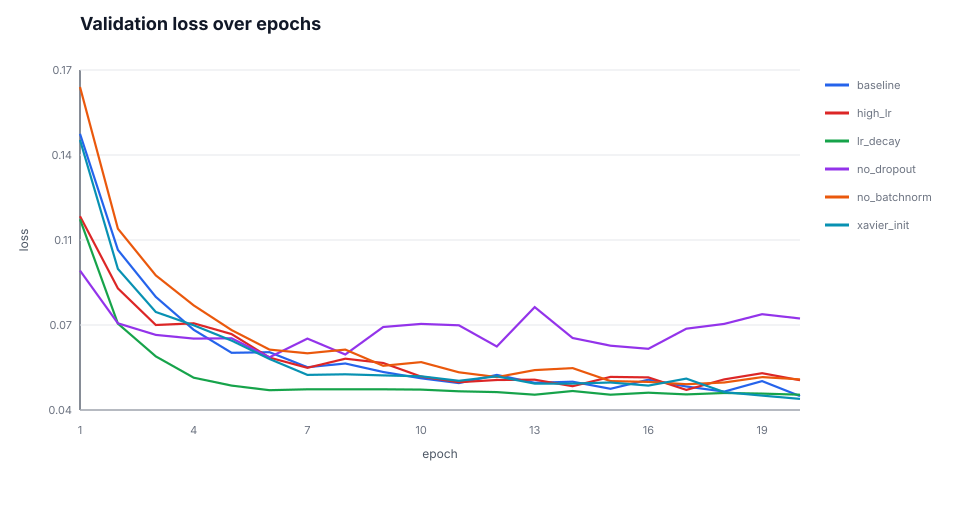

# MNIST 전략 비교 실험 보고서

## 0. 반·팀원

| 항목 | 내용 |
| --- | --- |
| **반** | (기입) |
| **팀원** | (기입) |

---

## 1. 실험 목적

MNIST 10-class 분류를 **PyTorch/TensorFlow 없이 NumPy만으로 구현한 신경망**으로 수행하고, 학습률·Dropout·BatchNorm·초기화 전략이 학습 곡선과 테스트 성능에 미치는 영향을 비교한다.

본 보고서는 `experiment_logs/strategy_run_2026-05-27.txt`에 저장된 20 epoch 실행 로그를 기준으로 작성했다.

---

## 2. 모델 구조

| 구분 | 내용 |
| --- | --- |
| **입력** | 784차원 벡터 (28x28 픽셀, 0~1 정규화) |
| **기본 은닉층** | Affine(512) → BatchNorm → ReLU → Dropout → Affine(256) → BatchNorm → ReLU → Dropout |
| **출력층** | Affine(10) → Softmax |
| **손실 함수** | Cross Entropy Loss |

기본 구조는 `784 → 512 → 256 → 10`이며, 비교 전략에 따라 BatchNorm, Dropout, 초기화 방식만 변경했다.

---

## 3. 학습 설정 및 비교 전략

공통 설정은 다음과 같다.

| 항목 | 값 |
| --- | --- |
| 옵티마이저 | Adam |
| epochs | 20 |
| batch_size | 128 |
| 기본 learning rate | 0.001 |
| 기본 Dropout 비율 | 0.5 |
| 기본 BatchNorm momentum | 0.9 |
| 기본 초기화 | He |

비교한 6개 전략은 다음과 같다.

| 전략 | 변경 내용 | 비교 목적 |
| --- | --- | --- |
| `baseline` | Adam lr=0.001, BatchNorm 사용, Dropout 0.5, He 초기화 | 기준 모델 |
| `high_lr` | learning rate만 0.01로 증가 | 큰 학습률의 수렴 속도와 흔들림 확인 |
| `lr_decay` | `0.01 * 0.6^epoch`로 learning rate 감소 | 큰 lr로 시작한 뒤 안정화되는지 확인 |
| `no_dropout` | Dropout 제거 | 과적합 여부 확인 |
| `no_batchnorm` | BatchNorm 제거 | BatchNorm 유무에 따른 수렴 차이 확인 |
| `xavier_init` | He 대신 Xavier 초기화 | ReLU 네트워크에서 초기화 차이 확인 |

---

## 4. 실험 환경

- 실행 환경: Google Colab
- Python: Colab 기본 Python 3
- 사용 라이브러리: NumPy, Matplotlib
- 로그 파일: `experiment_logs/strategy_run_2026-05-27.txt`
- 시각화 생성 스크립트: `scripts/render_strategy_report_assets.py`

시각화는 아래 명령으로 재생성할 수 있다.

```bash
python3 scripts/render_strategy_report_assets.py
```

---

## 5. 결과

### 5.1 요약 결과

| strategy | final val acc | best val acc | best epoch | train acc | val loss | final lr | params |
| --- | ---: | ---: | ---: | ---: | ---: | ---: | ---: |
| baseline | 98.50% | 98.50% | 20 | 99.88% | 0.0499 | 0.001000 | 537,354 |
| high_lr | 98.48% | 98.48% | 20 | 99.74% | 0.0555 | 0.010000 | 537,354 |
| lr_decay | 98.37% | 98.41% | 13 | 99.53% | 0.0504 | 0.000001 | 537,354 |
| no_dropout | 98.17% | 98.36% | 16 | 99.88% | 0.0773 | 0.001000 | 537,354 |
| no_batchnorm | 98.40% | 98.52% | 16 | 99.85% | 0.0558 | 0.001000 | 535,818 |
| xavier_init | 98.51% | 98.51% | 20 | 99.87% | 0.0489 | 0.001000 | 537,354 |

모든 전략이 목표 정확도 97%를 넘겼다. 최종 정확도는 `xavier_init`이 98.51%로 가장 높았고, 최고 epoch 기준으로는 `no_batchnorm`이 16 epoch에서 98.52%를 기록했다.

### 5.2 최종·최고 검증 정확도 비교



최종 검증 정확도는 `xavier_init`, `baseline`, `high_lr`가 거의 같은 수준이다. 전략 간 최종 정확도 차이는 최대 0.34%p로 작다. 즉, 이 실험에서는 정확도 숫자 하나보다 loss 안정성, train-validation gap, epoch별 변화를 같이 보는 것이 더 의미 있다.

### 5.3 최종 검증 손실 비교



`xavier_init`의 최종 validation loss가 0.0489로 가장 낮고, `baseline`도 0.0499로 거의 동일하다. 반면 `no_dropout`은 최종 정확도도 낮고 validation loss가 0.0773으로 가장 높다.

### 5.4 Train-validation 정확도 차이



`no_dropout`은 최종 train accuracy가 99.88%로 매우 높지만 validation accuracy는 98.17%에 머물러 gap이 1.71%p로 가장 크다. Dropout을 제거하면 학습 데이터에는 더 잘 맞지만 일반화 성능은 상대적으로 떨어질 수 있음을 보여준다.

### 5.5 Epoch별 validation accuracy



대부분의 전략은 5~10 epoch 사이에 98% 근처까지 빠르게 도달하고, 이후에는 작은 폭으로만 개선된다. `lr_decay`는 13 epoch에서 최고점을 찍은 뒤 거의 정체했고, `baseline`과 `xavier_init`은 20 epoch까지 완만하게 상승했다.

### 5.6 Epoch별 validation loss



`no_dropout`은 초반에 빠르게 loss가 내려가지만 후반 validation loss가 다시 커지거나 흔들리는 구간이 있다. 이는 train loss가 매우 낮은 것과 함께 과적합 가능성을 보여준다. `baseline`, `lr_decay`, `xavier_init`은 후반 validation loss가 0.05 근처에서 비교적 안정적으로 유지된다.

---

## 6. 해석 및 회고

### 학습률 비교

`high_lr`는 learning rate를 0.01로 키웠지만 최종 정확도는 98.48%로 `baseline` 98.50%와 거의 차이가 없었다. 최종 validation loss는 `baseline`보다 높아, 이 모델에서는 단순히 학습률을 크게 하는 것이 뚜렷한 이득으로 이어지지 않았다.

`lr_decay`는 초반에 빠르게 성능이 올라갔지만 learning rate가 급격히 작아지면서 후반 개선 폭이 줄었다. 최고 정확도는 13 epoch의 98.41%였고, 이후 거의 정체했다. 감소 스케줄이 안정화에는 도움이 되지만, 이 실험에서는 후반 학습을 너무 빨리 멈추게 만든 것으로 볼 수 있다.

### Dropout 비교

`no_dropout`은 train loss가 0.0056까지 내려가 모든 전략 중 가장 낮았다. 그러나 validation loss는 0.0773으로 가장 높고 final validation accuracy도 98.17%로 가장 낮았다. 따라서 Dropout 제거는 학습 데이터 적합은 강화했지만 일반화에는 불리했다.

### BatchNorm 비교

`no_batchnorm`은 BatchNorm을 제거했지만 최고 validation accuracy 98.52%를 기록했다. 다만 최종 validation loss는 0.0558로 `baseline`보다 높았다. 이 결과만 보면 BatchNorm이 반드시 최종 정확도를 높인다고 말하기는 어렵지만, `baseline`이 더 낮은 loss로 안정적인 수렴을 보였다.

### 초기화 비교

`xavier_init`은 최종 validation accuracy 98.51%, validation loss 0.0489로 가장 좋은 최종 결과를 냈다. 일반적으로 ReLU에는 He 초기화가 더 자주 쓰이지만, 이번 구조와 Adam 조합에서는 Xavier 초기화도 충분히 잘 동작했다.

---

## 7. 결론

6개 전략 모두 97% 이상의 목표 정확도를 달성했다. 최종 정확도만 보면 전략 간 차이가 작지만, loss와 train-validation gap을 함께 보면 차이가 더 분명하다.

- 가장 높은 최종 정확도: `xavier_init` 98.51%
- 가장 높은 최고 정확도: `no_batchnorm` 98.52% at epoch 16
- 가장 안정적인 기준 전략: `baseline`
- 과적합 경향이 가장 뚜렷한 전략: `no_dropout`
- 학습률 감소 전략: 초반 수렴은 빠르지만 후반 개선이 일찍 정체됨

보고서 관점에서는 `baseline`을 최종 모델 후보로 두고, `xavier_init`을 추가 후보로 비교하는 것이 적절하다. `no_dropout` 결과는 Dropout의 일반화 효과를 설명하는 반례 실험으로 활용할 수 있다.
